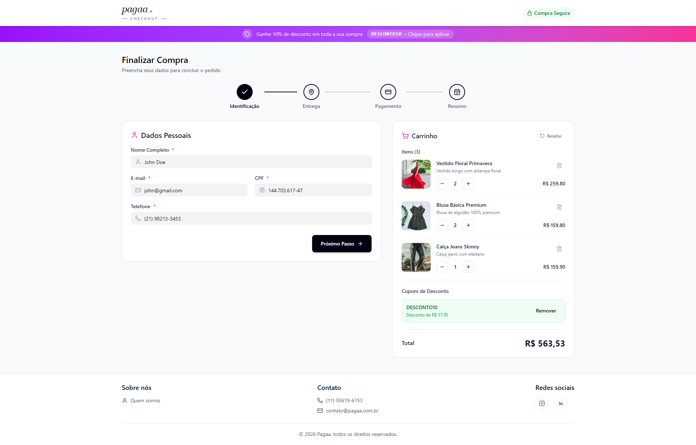
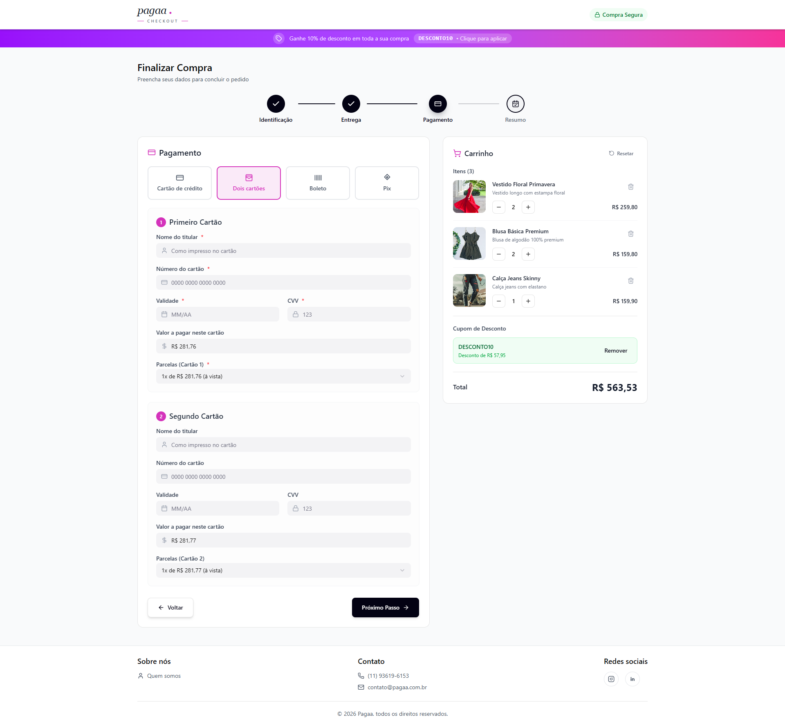

# Pagaa - Teste Front-end
Este projeto é uma aplicação de Checkout desenvolvida para a Pagaa. 
A aplicação simula um fluxo de compra completo, desde a inserção de dados pessoais e endereço até a escolha do método de pagamento e confirmação do pedido.

## 🚀 Tecnologias
O projeto foi construído utilizando as seguintes tecnologias:

-   **Vite**: Ferramenta de build extremamente rápida.
-   **React 19**: Biblioteca principal para construção da interface.
-   **TypeScript**: Superconjunto de JavaScript que adiciona tipagem estática.
-   **React Router 7**: Gerenciamento de rotas.
-   **Tailwind CSS 4**: Framework utilitário para estilização.
-   **Shadcn/ui**: Componentes de interface acessíveis e customizáveis (baseados em Radix UI).
-   **React Hook Form**: Gerenciamento de formulários.
-   **Zod**: Validação de esquemas de dados.
-   **TanStack Query (React Query) v5**: Gerenciamento de estado assíncrono e cache de dados.
-   **Axios**: Cliente HTTP para requisições à API.
-   **Lucide React**: Biblioteca de ícones.
-   **Sonner**: Notificações toast elegantes.
-   **JSON Server**: Utilizado para simular uma API REST para o desenvolvimento.

## ✨ Funcionalidades
-   **Fluxo de Checkout em Etapas (Stepper):**
    -   Informações Pessoais.
    -   Endereço (com busca automática via CEP através da API ViaCEP).
    -   Seleção de Método de Pagamento (Cartão de Crédito, 2 Cartões, Pix, Boleto).
    -   Resumo do Pedido.
-   **Validação de Formulários:** Garantia de que todos os dados obrigatórios sejam preenchidos corretamente em cada etapa.
-   **Responsividade:** Interface adaptável para diferentes tamanhos de tela.
-   **Feedback Visual:** Notificações de sucesso e erro.
-   **Mocks de Dados:** Utilização do JSON Server para persistência simulada de dados de checkout.

## 🌐 Deployment
O projeto possui duas versões implantadas no Heroku para demonstração:

- **Versão 1 (Principal):** Checkout completo com fluxo em etapas (stepper) e integração de endereço via API ViaCep.
  - [Acessar Versão 1](https://teste-front-pagaa-7615e3f2d103.herokuapp.com/)
  
- **Versão 2:** Checkout em página única (single page) focado na rapidez, sem a necessidade de endereço de entrega.
  - [Acessar Versão 2](https://teste-front-single-page-pagaa-a50d086960f0.herokuapp.com/)

## 📸 Screenshots
### Versão 1 - Checkout com Stepper
| Passo 1: Dados Pessoais | Passo 2: Endereço |
| :---: | :---: |
|  |  |

| Passo 3: Pagamento | Passo 4: Resumo |
|  |  |

### Versão 2 - Single Page
| Interface Simplificada |
|  |

## 📦 Como rodar o projeto

### Pré-requisitos
-   [Node.js](https://nodejs.org/) (versão 18 ou superior recomendada)
-   npm ou yarn

### Instalação
1. Clone o repositório:
   ```bash
   git clone https://github.com/seu-usuario/teste-front-pagaa.git
   cd teste-front-pagaa
   ```

2. Instale as dependências:
   ```bash
   npm install
   ```

### Execução
Para rodar o projeto em ambiente de desenvolvimento (Vite + JSON Server simultaneamente):
```bash
npm start
```

Isso iniciará:
- O frontend na porta `5173` (ou a próxima disponível).
- O mock da API na porta `3001`.

Outros comandos disponíveis:
- `npm run dev`: Inicia apenas o frontend.
- `npm run server`: Inicia apenas o JSON Server (mock da API).
- `npm run build`: Gera a build de produção.
- `npm run lint`: Executa o linter.

## 📂 Estrutura de Pastas
```text
src/
├── api/             # Configurações de clientes HTTP (Axios, ViaCEP)
├── assets/          # Imagens e ícones estáticos
├── components/      # Componentes globais e UI (Shadcn)
├── features/        # Módulos de funcionalidades (ex: Checkout)
│   └── Checkout/    # Lógica, componentes e hooks específicos do checkout
├── lib/             # Utilitários e constantes globais
├── pages/           # Componentes de página (rotas)
├── styles/          # Estilos globais e animações
├── App.tsx          # Componente raiz e roteamento
└── main.tsx         # Ponto de entrada da aplicação
```
